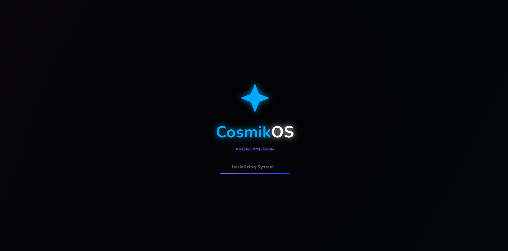
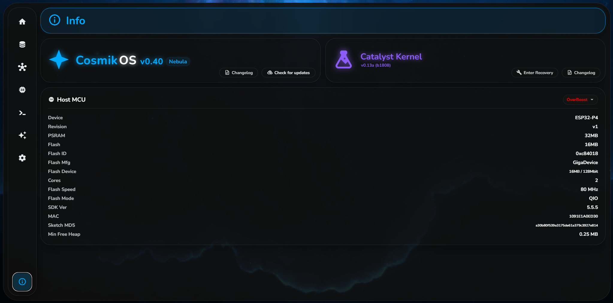

# CosmikOS with Catalyst Kernel

  
  

CosmikOS is a lightweight, modular operating system built for modern ESP32-based boards.

It is the core OS behind the **TerrariumX ecosystem**, but it can also be used as a standalone platform for advanced ESP32 projects that need reliability, structure, and a clean local interface.

CosmikOS is designed with a simple idea in mind: **treat embedded systems like real systems**, not disposable hardware and software.

---

## ✨ What CosmikOS is about

CosmikOS focuses on:

* 🧩 **Modularity** – services are independent and restartable (WIP, based on FreeRTOS Tasks)
* 🌐 **Local-first operation** – no cloud required
* 🔌 **MQTT-native design** – easy Home Assistant and automation integration
* 🖥️ **Modern WebUI** – animated, responsive, and optimized for embedded hardware
* 🛠️ **Long-term support** – hardware and software designed to evolve together

---

## 🧪 Catalyst Kernel

Catalyst Kernel is the base or backend of CosmikOS, it manages:

* **HAL** - Hardware Abstraction Layer
* **WebUI Integration**
* **Smart Home Integration**
* **Sensor Auto-Discovery and Auto-Config**
* **Sanity Checks**
* **Wifi and LAN Connectivity**
* **Module Management** - Like screens
* **Auto-Updates** - Updates automatically only using a button, no necessity for manually flashing
* **Config Read and Write**

---

## 🧩 Supported Boards and Hardware

### Espressif SoCs

| Family             | Supported  | Tested in Preview Builds? | Notes                                                  |
| ------------------ | ---------- | ------------------------- |------------------------------------------------------- | 
| ESP32-P4           | ✅         | ✅                       | Primary target platform                                 | 
| ESP32-S31          | ⚠️ WDB     | ⚠️ WDB                   | Possibly supported at launch or shortly after           |
| ESP32-S3           | ✅         | ✅                       | Supported at launch                                     |
| ESP32-S2           | 🛠️         | ❌                       | Supported after update                                  |
| ESP32-C6           | 🛠️         | ✅                       | Supported after update                                  |
| ESP32-C61          | 🛠️         | ❌                       | Supported after update                                  |
| ESP32-C5           | 🛠️         | ✅                       | Supported after update                                  |
| ESP32-C3           | 🛠️         | ❌                       | Supported after update                                  |
| ESP8685 (C3 Based) | 🛠️         | ❌                       | Supported after update                                  |
| ESP32-C2 (ESP8684) | 🛠️         | ❌                       | Supported after update                                  |
| ESP32-H2           | 🛠️         | ❌                       | Limited Connectivity, Unknown support in the future     |
| ESP32              | 🛠️         | ❌                       | Supported soon after launch                             |
| ESP32-E22          | ❓TBA      | ❌                       | Unreleased Module                                       |
| ESP32-H21          | ❓TBA      | ❌                       | Unreleased Module                                       |
| ESP32-H4           | ❓TBA      | ❌                       | Unreleased Module                                       |

> Specific board support may vary in capabilities depending on the board hardware configuration.

> Boards marked with ⚠️ WDB (Waiting Devkit Board) are high priority modules, just waiting to be supported and to be tested in order to verify functionality 

> The ESP8266 and ESP8285 are not supported at launch because they are marked NRND by Espressif and lack full FreeRTOS support, which is a core requirement for CosmikOS.

> Any Hardware that Espressif releases later on will be placed in the table above as soon as possible

### General Requirements
|           | MCU Family          | Flash  | PSRAM  | Connectivity               | Software Capability |
| --------- | ------------------- | ------ | ------ | -------------------------- | ------------------- |
| Suggested | ESP32-S2+           | >= 8MB | >= 1MB | WiFi and/or Ethernet + BLE | FreeRTOS Enabled    |
| Minimal   | Any ESP32-class SoC | >= 4MB | >= 0MB | WiFi / ETH                 | FreeRTOS Enabled    |

---

## 🌐 WebUI

CosmikOS includes a fully local WebUI that runs directly on the device:

* Modern Material-inspired design
* Smooth animations and micro-interactions
* System monitoring and diagnostics
* Power and service control
* OTA and update management (experimental)

Despite the visual complexity, the WebUI is designed to stay lightweight and efficient, making it suitable even for constrained embedded hardware.

---

## 🔄 Updates, OTA & long-term support

CosmikOS uses a user-controlled update model.

### Major Updates 

CosmikOS will receive major updates about every year, that include lots of new features, bugfixes, UI changes, software improvements, optimization (may be kinda buggy at release)

Major updates can be recognized by a change in the first value for the version (like from 1.x.x to 2.x.x)

### Cumulative updates

CosmikOS will receive cumulative updates, that can run on a monthly schedule, they mostly include bug fixes and minor UI changes, along optimizations and API changes.

Cumulative release can be recognized from the second value of the version changing (like from x.1.x to x.2.x)

### Minor Updates

RadonOS is also subject to minor releases, that can follow a weekly or daily schedule, they include minor bug fixes, no UI changes and optimizations

They can be recognized from the third value of the version changing (like in x.x.0 to x.x.1)

### Build number

Build numbers in CosmikOS are integer numbers that indicate the single modification of the code, they are usually present after the version: x.x.x xxxx where xxxx is the build number.

This value will change every release.

### Software EOL for RadonOS

Updates are never forced: the system checks for updates only when explicitly requested (unless you set the board to specifically auto-check), and applying them is always a conscious user action (unless auto-update is active).

When a board or firmware branch reaches **End Of Life (EOL)**, it enters a **Frozen** state:
- The device remains fully functional
- No new features or updates are provided (unless they are important bug fixes)
- The last supported firmware version remains available
- No forced updates, migrations, or shutdowns occur
- The EOL / Frozen status is clearly reported in the local WebUI (while not being disturbing, just the update button becomes unusable and there is a popup every reboot remembering why)

This approach prioritizes long-term stability and ensures that deployed systems can continue to operate reliably without unexpected changes.

Based on Espressif’s **Longevity Commitment**, currently supported hardware will enter the **Frozen** state (no further updates) according to the following timeline:

| SoC        | EOL Year | Currently supported |
| ---------- | -------- | ------------------- |
| ESP32-P4   | 2037     | ✅ Yes              |
| ESP32-E22  | TBA      | ❌ Not Yet          |
| ESP32-S31  | TBA      | ❌ Not Yet          |
| ESP32-S3   | 2033     | ✅ Yes              |
| ESP32-S2   | 2032     | ✅ Yes              |
| ESP32-C6   | 2035     | ✅ Yes              |
| ESP32-C61  | 2037     | ✅ Yes (initial)    |
| ESP32-C5   | 2037     | ✅ Yes              |
| ESP32-C3   | 2033     | ✅ Yes              |
| ESP8685    | 2033     | ✅ Yes              |
| ESP32-C2   | 2034     | ✅ Yes              |
| ESP8684    | 2034     | ✅ Yes              |
| ESP32-H4   | TBA      | ❌ Not Yet          |
| ESP32-H21  | TBA      | ❌ Not Yet          |
| ESP32-H2   | 2035     | ✅ Yes              |
| ESP32      | 2031     | ✅ Yes              |

> Models marked as **TBA** do not yet have an official EOL date, as they are not currently listed in Espressif’s longevity commitment.

> Support for each device ends on **January 1st** of the year specified in the table.

---

## 🚧 Project Status

CosmikOS is under **active development and in very early pre-production stage**.

This means:

* Rapid iteration
* New features arriving frequently
* Possible breaking changes in early versions

If you are using CosmikOS for testing or development, feedback is highly appreciated.

---

## 🤝 Contributing

Contributions are welcome.

You can help by:

* Testing on supported boards
* Reporting issues
* Improving documentation
* Adding support for new hardware

Feel free to open issues or pull requests.

---

## 🔓 License

CosmikOS is fully **open source** and free to use.

See the LICENSE file for detailed license information as soon as it is available.
